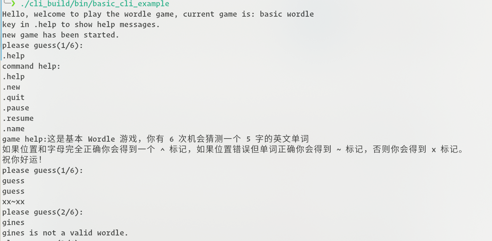
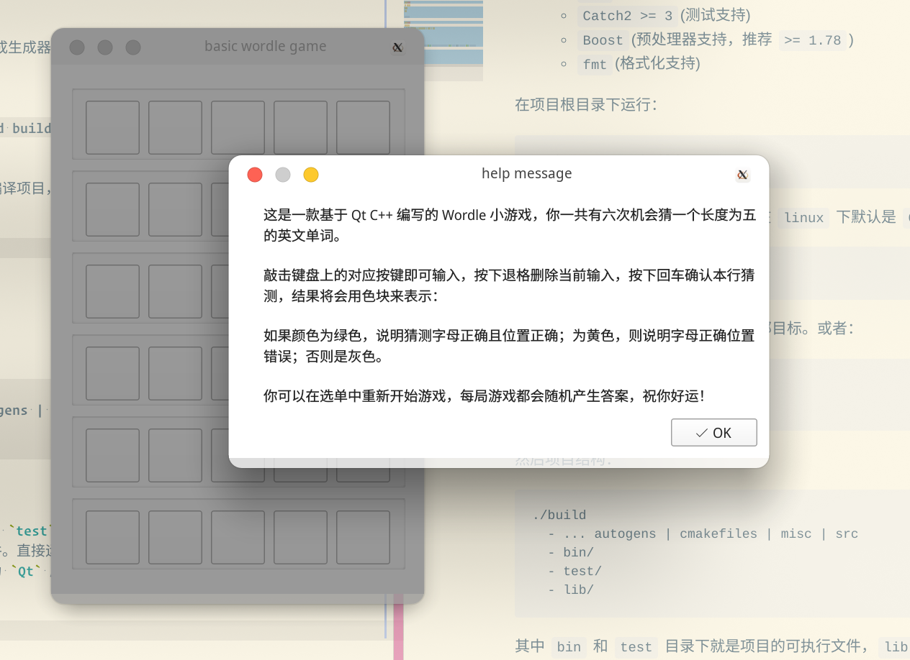

## Cpp Wordle


本项目使用 cpp 实现了著名的游戏 wordle，他的规则可以参见 [wiki](https://en.wikipedia.org/wiki/Wordle)。

### 编译和运行

前提条件：

- compiler: `gcc >= 11 || clang >= 12` (no msvc support)
    - 推荐 `gcc 12.1 || clang 14.0`
- build tool: `cmake >= 3.13`
    - 推荐使用 `ninja`
- os: `linux-x86_64` or `MacOS`(未测试的！)
- library:
    - `Qt6`(UI 支持和字符串类支持)
    - `Catch2 >= 3`(测试支持)
    - `Boost`(预处理器支持，推荐 `>= 1.78`)
    - `fmt`(格式化支持)
    - `matchit`(项目自带依赖，在 `packages` 下面)

在项目根目录下运行：

```sh
cmake -S . -B build
# 可选：使用 ninja 并启动 debug 编译
# cmake -S . -B build -DCMAKE_BUILD_TYPE=DEBUG -DRunge_Debug=On -G Ninja
```

`cmake` 将完成生成器的配置工作，在 `linux` 下默认是 `GNU Makefile`。

```sh
cmake --build build
```

在指定目录中编译项目，默认编译全部目标。或者：

```sh
cd build
make
```

然后项目结构：

```sh
./build
  - ... autogens | cmakefiles | misc | src
  - bin/
  - test/
  - lib/
```

其中 `bin` 和 `test` 目录下就是项目的可执行文件，`lib` 下是生成的静态库文件。直接运行即可（需要保证 `Qt` 库在你的 path 中可以找到，因为 `Qt` 库是共享连接的）。

运行例子：




### 项目结构

#### 已废弃或未实现结构

- [`exceptions`](src/exceptions)
- [`guards`](src/guards)
- [`legacy`](src/legacy)
- [`protocols`](src/protocals)

#### 工具

[这里](src/utilities)，提供了通用的工具，包括：

- `colored_cli`，命令行颜色支持；
- `macros`，宏自动代码生成支持；
- `io_device`，定义了 Qt 基本的 IO 设备；
- `result_type`，定义了最简单的 `<Ok, Err>` 和类型；
- `stringizer`，定义了简单的字符串化类，并支持特化；
- `debug_utilities`，定义了调试相关的宏。

#### 概念

[下面](src/concepts)定义了 Wordle 游戏必须的概念，例如：

- 什么是一个**Wordle** `Runge::Concepts::is_wordle`；
- 什么是一个**受比较 Wordle** `Runge::Concepts::is_compared_wordle`；

等等。注意，时间所限，有一些必要的概念并未实现，例如：

- 什么是一个**单独游戏**；
- 什么是一个**指令**；
- 什么是一个**比较标记**；

你所看到的全部黑体加粗的内容应该是具有语义约束的某个概念或者接口，不过可能尚未实现。

#### 接口

[下面](src/interfaces)定义了 GUIWordle 游戏必须的接口（这是因为 Qt GUI 编程习惯这种范式），例如：

- **单独游戏控件接口** `IGameWidget`，指明某个 `widget` 可以嵌入**游戏框架**。

注意，`WordleInterfaces` 均已废弃，实际上并未使用。

#### 游戏

有两种基本类别，CLI 和 GUI 游戏，前者依靠 `stdin, stdout` 作为输出输入设备，使用概念约束游戏类型；后者则依靠 `QMainWindow, QWidget` 类作为前端，使用接口保证约束。

架构：
  - **游戏框架**，负责运行任何游戏，处理指令，是最高的抽象层，他并不关心游戏实现为什么，只要实现了对应的**单独游戏**的约束。
    - 特别的，**单纯游戏框架**，仅仅容纳一个**单独游戏**的架构。
    - 本项目只有**单纯游戏框架**，位于[这里](src/game_frameworks)；
  - **单独游戏**，通常不是一个自立的对象，但是它封装了游戏的全部实现，它的对象可以传入**游戏框架**。
    - 本项目包含 QtCLI **单独游戏模板**和 QtGUI 的基本 Wordle 单独游戏，位于[这里](src/single_games)。
  - 中间层，包括[**指令**](src/tools/commands.hpp)和[**游戏状态标记**](src/tools/marks.hpp)，通过他们**游戏框架**和**单独游戏**交换消息。
    - 注意 QtGUI 的中间层则是基于 Qt 事件循环；
  - [**游戏组件**](src/components)，将每个功能拆分开来的 Wordle 游戏的必要部分，包括了：

    - **Wordle** 存储 wordle 的数据结构。
    - **ComparedWordle** 存储某个 wordle 以及它和答案比较的结果的数据结构。
    - **WordleComparator** 抽象类，静态方法用来比较两个 wordle，返回受比较的 wordle；
    - **WordleGenerator** 依赖于资源控制器，通常是随机抽取一个 wordle；
    - **WordleFormatter** 格式化器，抽象类，静态方法将 wordle 和受比较 wordle 输入到指定的流中；
    - **WordleParser** 解析器，依赖于资源控制器，从字符串中构造 wordle。
    - **ResourceHolder** 资源控制器，通常在初始化阶段从文件中构建 wordle 列表。
    
    我们对标准的容器和字符串提供了通用的[**比较器**](src/tools/comparators.hpp)和[**生成器**](src/tools/generators.hpp)。
  - **GUI 游戏组件**，同上，但是他仅仅用于 QtGUI 游戏，主要提供了必要的按钮类和简单的动画等等。

将上面的部件组合，就获得了一个游戏，所有可运行游戏都在[例子目录](src/examples)下面。

#### 测试

只有部分测试完成了，并且没有整合到 CTest，所有测试在[这里](test/)。